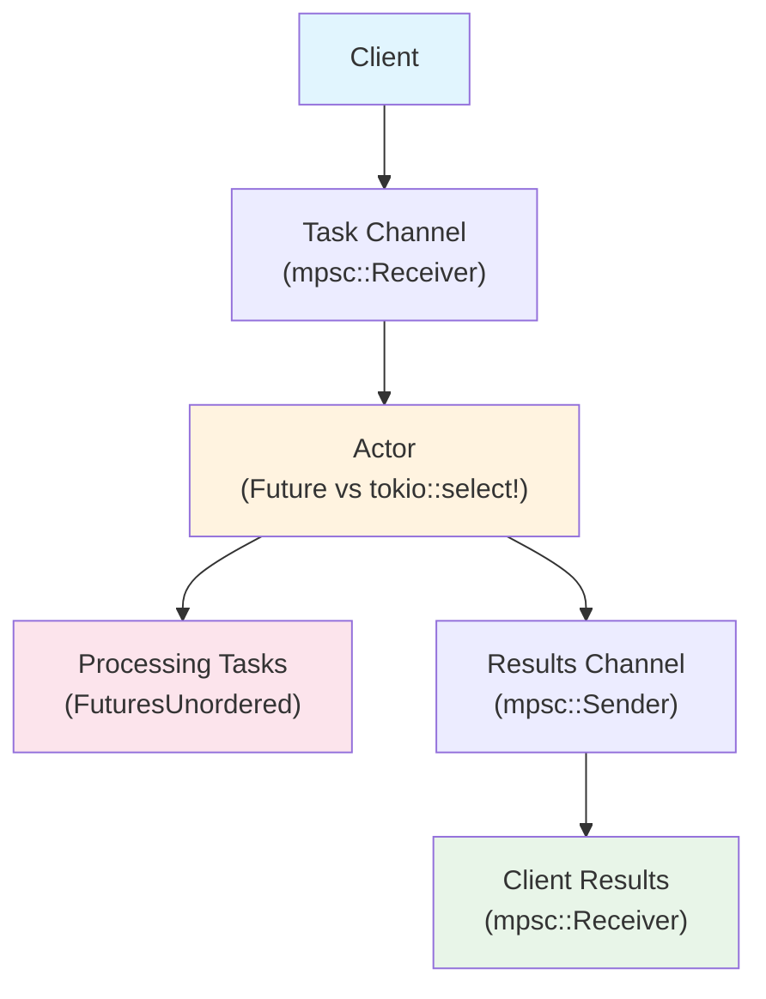

# 01: `Future` implementation vs. `tokio::select!` loop for actors

- [Overview](#overview)
- [Results](#results)

## Overview
This benchmark compares the performance of a `Future` implementation vs. a `tokio::select!` loop for long-running actors.
The basic flow looks like this:



The workload is a simple task that is initialized with an input (`std::time::Instant`), adds 10 microseconds of delay (in the form of `tokio::time::sleep`), and returns the input. The input is also used to measure the processing latency of each task in the latency benchmark.

## Results
- Tasks: 50000
- Iterations: 100
- System: Apple M4 Pro, 10 Cores, 32GB RAM
- Command: `cargo bench 01`

### Latency
```
┌──────────────────────────┬──────────────┬────────────────┬─────────────┬─────────────┬─────────────┬─────────────┬─────────────┐
│ actor_type               │ mean_latency │ median_latency │ min_latency │ max_latency │ p10_latency │ p90_latency │ p99_latency │
├──────────────────────────┼──────────────┼────────────────┼─────────────┼─────────────┼─────────────┼─────────────┼─────────────┤
│ FutureActorUnconstrained │ 756.36µs     │ 732.33µs       │ 15.21µs     │ 2.88ms      │ 502.17µs    │ 1.00ms      │ 1.86ms      │
├──────────────────────────┼──────────────┼────────────────┼─────────────┼─────────────┼─────────────┼─────────────┼─────────────┤
│ RandomSelectActor        │ 3.61ms       │ 3.87ms         │ 31.79µs     │ 8.72ms      │ 1.38ms      │ 5.35ms      │ 6.84ms      │
├──────────────────────────┼──────────────┼────────────────┼─────────────┼─────────────┼─────────────┼─────────────┼─────────────┤
│ BiasedSelectActor        │ 3.77ms       │ 3.98ms         │ 18.71µs     │ 8.50ms      │ 1.15ms      │ 5.71ms      │ 7.31ms      │
├──────────────────────────┼──────────────┼────────────────┼─────────────┼─────────────┼─────────────┼─────────────┼─────────────┤
│ FutureActor              │ 10.86ms      │ 10.03ms        │ 15.21µs     │ 27.25ms     │ 2.78ms      │ 20.16ms     │ 24.81ms     │
└──────────────────────────┴──────────────┴────────────────┴─────────────┴─────────────┴─────────────┴─────────────┴─────────────┘
```
### Throughput & Memory Usage
```
┌──────────────────────────┬───────────────┬─────────────────┬─────────────────┬───────────────────┬──────────────┬──────────────┬────────────────┬────────────────┬───────────────────┐
│ actor_type               │ mean_duration │ mean_throughput │ median_duration │ median_throughput │ min_duration │ max_duration │ min_throughput │ max_throughput │ max_pending_tasks │
├──────────────────────────┼───────────────┼─────────────────┼─────────────────┼───────────────────┼──────────────┼──────────────┼────────────────┼────────────────┼───────────────────┤
│ RandomSelectActor        │ 12.37ms       │ 4.070M          │ 11.97ms         │ 4.186M            │ 11.22ms      │ 19.49ms      │ 2.565M         │ 4.458M         │ 9984              │
├──────────────────────────┼───────────────┼─────────────────┼─────────────────┼───────────────────┼──────────────┼──────────────┼────────────────┼────────────────┼───────────────────┤
│ FutureActorUnconstrained │ 13.61ms       │ 3.678M          │ 13.69ms         │ 3.655M            │ 12.30ms      │ 14.37ms      │ 3.479M         │ 4.065M         │ 10304             │
├──────────────────────────┼───────────────┼─────────────────┼─────────────────┼───────────────────┼──────────────┼──────────────┼────────────────┼────────────────┼───────────────────┤
│ BiasedSelectActor        │ 14.01ms       │ 3.568M          │ 14.03ms         │ 3.565M            │ 13.54ms      │ 14.95ms      │ 3.344M         │ 3.692M         │ 12606             │
├──────────────────────────┼───────────────┼─────────────────┼─────────────────┼───────────────────┼──────────────┼──────────────┼────────────────┼────────────────┼───────────────────┤
│ FutureActor              │ 37.08ms       │ 1.359M          │ 37.25ms         │ 1.344M            │ 29.45ms      │ 49.50ms      │ 1.010M         │ 1.698M         │ 12772             │
└──────────────────────────┴───────────────┴─────────────────┴─────────────────┴───────────────────┴──────────────┴──────────────┴────────────────┴────────────────┴───────────────────┘
```

### Load (CPU)
```
┌──────────────────────────┬────────┬──────────────────┬───────────────────────┬───────────────────────┬────────────────────┬─────────────────────────┬────────────────────┬─────────────────────────┬─────────────────────────┬─────────────────┐
│ actor_type               │ load   │ total_poll_count │ total_fast_poll_count │ total_slow_poll_count │ mean_idle_duration │ mean_scheduled_duration │ mean_poll_duration │ mean_fast_poll_duration │ mean_slow_poll_duration │ slow_poll_ratio │
├──────────────────────────┼────────┼──────────────────┼───────────────────────┼───────────────────────┼────────────────────┼─────────────────────────┼────────────────────┼─────────────────────────┼─────────────────────────┼─────────────────┤
│ FutureActorUnconstrained │ 58.09% │ 40505            │ 39666                 │ 839                   │ 12.09µs            │ 5.03µs                  │ 16.72µs            │ 9.45µs                  │ 360.41µs                │ 2.07%           │
├──────────────────────────┼────────┼──────────────────┼───────────────────────┼───────────────────────┼────────────────────┼─────────────────────────┼────────────────────┼─────────────────────────┼─────────────────────────┼─────────────────┤
│ BiasedSelectActor        │ 76.61% │ 82224            │ 82167                 │ 57                    │ 2.63µs             │ 6.03µs                  │ 8.57µs             │ 8.54µs                  │ 56.17µs                 │ 0.07%           │
├──────────────────────────┼────────┼──────────────────┼───────────────────────┼───────────────────────┼────────────────────┼─────────────────────────┼────────────────────┼─────────────────────────┼─────────────────────────┼─────────────────┤
│ RandomSelectActor        │ 85.15% │ 81301            │ 81091                 │ 210                   │ 1.42µs             │ 5.53µs                  │ 8.13µs             │ 7.93µs                  │ 84.28µs                 │ 0.26%           │
├──────────────────────────┼────────┼──────────────────┼───────────────────────┼───────────────────────┼────────────────────┼─────────────────────────┼────────────────────┼─────────────────────────┼─────────────────────────┼─────────────────┤
│ FutureActor              │ 90.61% │ 85752            │ 72722                 │ 13030                 │ 2.58µs             │ 19.62µs                 │ 23.08µs            │ 14.89µs                 │ 68.75µs                 │ 15.19%          │
└──────────────────────────┴────────┴──────────────────┴───────────────────────┴───────────────────────┴────────────────────┴─────────────────────────┴────────────────────┴─────────────────────────┴─────────────────────────┴─────────────────┘
```

## Notes
- The `load` column is derived from [`TaskMetrics`](https://docs.rs/tokio-metrics/0.4.2/tokio_metrics/struct.TaskMetrics.html) as: `total_poll_duration / (total_poll_duration + total_idle_duration)`
- Why would `load` be so much lower with `tokio::coop::unconstrained`? I would expect it to be higher, since it's not constrained by the scheduler. It may be because of the overhead from
context switching.