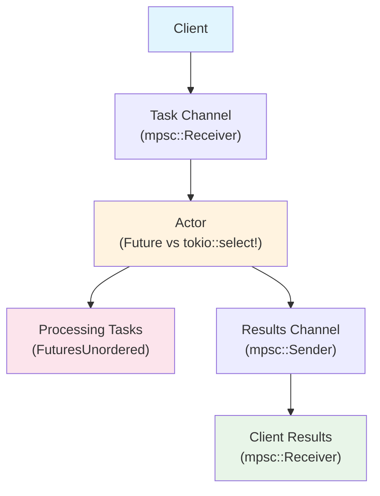

# 01: `Future` implementation vs. `tokio::select!` loop for actors

- [Overview](#overview)
- [Results](#results)

## Overview
This benchmark compares the performance of a `Future` implementation vs. a `tokio::select!` loop for long-running actors.
The basic flow looks like this:

The workload is a simple task that multiplies a number by 2 and adds 10 microseconds of delay (in the form of `tokio::time::sleep`).

## Results
### Latency
TODO
### Throughput
TODO
### Memory Usage
TODO

## Notes
- Understand why `tokio::unconstrained` on the `FutureActor` is necessary to get the same performance as the `tokio::select!` loop.