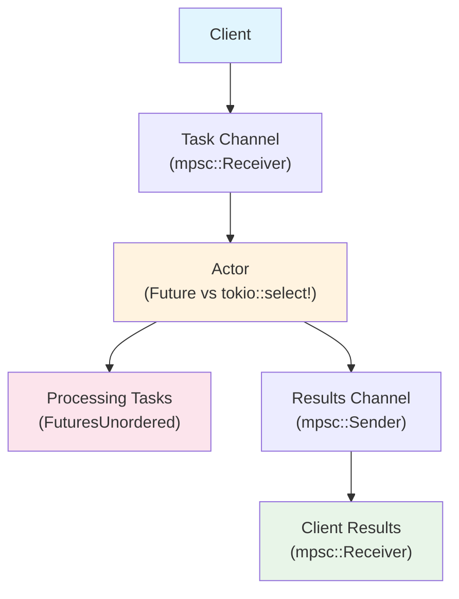

# 01: `Future` implementation vs. `tokio::select!` loop for actors

- [Overview](#overview)
- [Results](#results)

## Overview
This benchmark compares the performance of a `Future` implementation vs. a `tokio::select!` loop for long-running actors.
The basic flow looks like this:



The workload is a simple task that multiplies a number by 2 and adds 10 microseconds of delay (in the form of `tokio::time::sleep`).

## Results
```
     Running benches/01.rs (target/release/deps/01-1b60dc2a7cf15ec8)
future_actor_50000_tasks_current_thread
                        time:   [34.018 ms 34.472 ms 34.953 ms]
                        change: [−4.0613% −2.1450% −0.0726%] (p = 0.04 < 0.05)
                        Change within noise threshold.
Found 2 outliers among 100 measurements (2.00%)
  1 (1.00%) low mild
  1 (1.00%) high severe

random_select_actor_50000_tasks_current_thread
                        time:   [9.6451 ms 9.6951 ms 9.7728 ms]
                        change: [−0.5601% +0.3528% +1.3270%] (p = 0.51 > 0.05)
                        No change in performance detected.
Found 11 outliers among 100 measurements (11.00%)
  5 (5.00%) low mild
  2 (2.00%) high mild
  4 (4.00%) high severe

biased_select_actor_50000_tasks_current_thread
                        time:   [9.2135 ms 9.2355 ms 9.2574 ms]
                        change: [−2.4821% −1.1221% −0.0589%] (p = 0.07 > 0.05)
                        No change in performance detected.

future_actor_50000_tasks_multi_thread
                        time:   [43.388 ms 44.672 ms 45.991 ms]
                        change: [−6.1029% −1.2956% +3.2385%] (p = 0.59 > 0.05)
                        No change in performance detected.
Found 1 outliers among 100 measurements (1.00%)
  1 (1.00%) high mild

random_select_actor_50000_tasks_multi_thread
                        time:   [14.720 ms 14.798 ms 14.900 ms]
                        change: [−0.0831% +0.7919% +1.6754%] (p = 0.08 > 0.05)
                        No change in performance detected.
Found 3 outliers among 100 measurements (3.00%)
  2 (2.00%) high mild
  1 (1.00%) high severe

biased_select_actor_50000_tasks_multi_thread
                        time:   [7.6774 ms 7.7143 ms 7.7668 ms]
                        change: [−0.2520% +0.6893% +1.6698%] (p = 0.14 > 0.05)
                        No change in performance detected.
Found 1 outliers among 100 measurements (1.00%)
  1 (1.00%) high severe
```