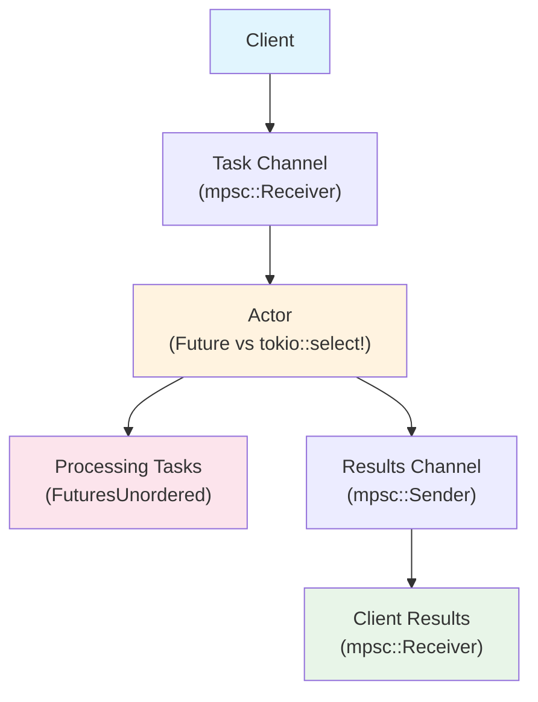

# 01: `Future` implementation vs. `tokio::select!` loop for actors

- [Overview](#overview)
- [Results](#results)

## Overview
This benchmark compares the performance of a `Future` implementation vs. a `tokio::select!` loop for long-running actors.
The basic flow looks like this:



The workload is a simple task that multiplies a number by 2 and adds 10 microseconds of delay (in the form of `tokio::time::sleep`).

## Results
### Latency
```
┌───────────────────┬──────────────┬────────────────┬─────────────┬─────────────┬─────────────┬─────────────┬─────────────┐
│ actor_type        │ mean_latency │ median_latency │ min_latency │ max_latency │ p10_latency │ p90_latency │ p99_latency │
├───────────────────┼──────────────┼────────────────┼─────────────┼─────────────┼─────────────┼─────────────┼─────────────┤
│ RandomSelectActor │ 3.61ms       │ 3.89ms         │ 19.00µs     │ 7.31ms      │ 1.46ms      │ 5.33ms      │ 5.69ms      │
├───────────────────┼──────────────┼────────────────┼─────────────┼─────────────┼─────────────┼─────────────┼─────────────┤
│ BiasedSelectActor │ 3.78ms       │ 3.93ms         │ 18.92µs     │ 8.43ms      │ 1.16ms      │ 5.79ms      │ 7.25ms      │
├───────────────────┼──────────────┼────────────────┼─────────────┼─────────────┼─────────────┼─────────────┼─────────────┤
│ FutureActor       │ 11.16ms      │ 10.27ms        │ 31.67µs     │ 29.51ms     │ 2.98ms      │ 20.60ms     │ 25.63ms     │
└───────────────────┴──────────────┴────────────────┴─────────────┴─────────────┴─────────────┴─────────────┴─────────────┘
```
### Throughput
```
┌───────────────────┬───────────────┬─────────────────┬─────────────────┬───────────────────┬──────────────┬──────────────┬────────────────┬────────────────┐
│ actor_type        │ mean_duration │ mean_throughput │ median_duration │ median_throughput │ min_duration │ max_duration │ min_throughput │ max_throughput │
├───────────────────┼───────────────┼─────────────────┼─────────────────┼───────────────────┼──────────────┼──────────────┼────────────────┼────────────────┤
│ RandomSelectActor │ 12.20ms       │ 4.137M          │ 11.84ms         │ 4.224M            │ 11.22ms      │ 26.80ms      │ 1.865M         │ 4.456M         │
├───────────────────┼───────────────┼─────────────────┼─────────────────┼───────────────────┼──────────────┼──────────────┼────────────────┼────────────────┤
│ BiasedSelectActor │ 13.96ms       │ 3.581M          │ 13.98ms         │ 3.576M            │ 13.54ms      │ 14.51ms      │ 3.447M         │ 3.692M         │
├───────────────────┼───────────────┼─────────────────┼─────────────────┼───────────────────┼──────────────┼──────────────┼────────────────┼────────────────┤
│ FutureActor       │ 38.18ms       │ 1.321M          │ 38.12ms         │ 1.314M            │ 29.84ms      │ 45.22ms      │ 1.106M         │ 1.676M         │
└───────────────────┴───────────────┴─────────────────┴─────────────────┴───────────────────┴──────────────┴──────────────┴────────────────┴────────────────┘
```
### Memory Usage
TODO

## Notes
- Understand why `tokio::unconstrained` on the `FutureActor` is necessary to get the same performance as the `tokio::select!` loop.