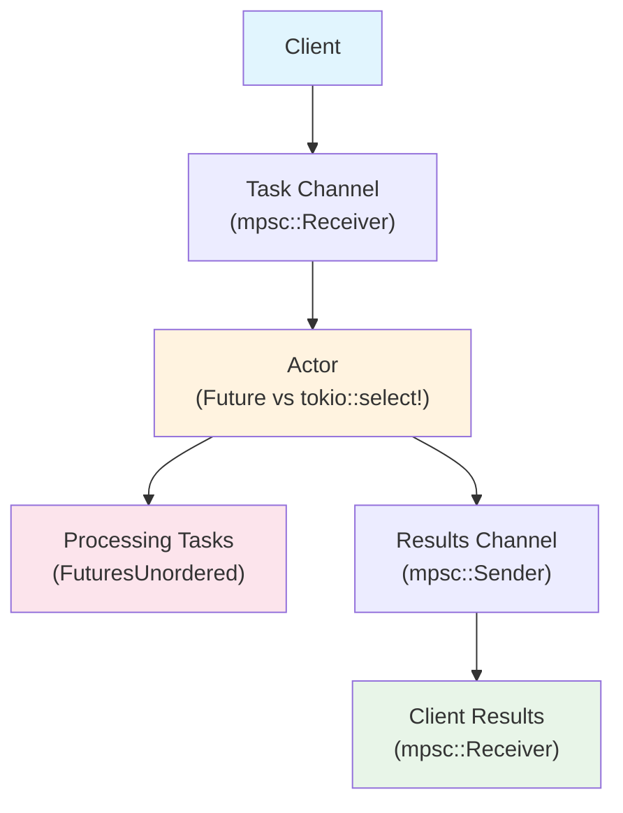

# 01: `Future` implementation vs. `tokio::select!` loop for actors

- [Overview](#overview)
- [Results](#results)

## Overview
This benchmark compares the performance of a `Future` implementation vs. a `tokio::select!` loop for long-running actors.
The basic flow looks like this:



The workload is a simple task that multiplies a number by 2 and adds 10 microseconds of delay (in the form of `tokio::time::sleep`).

## Results
- Tasks: 50000
- Iterations: 100
- Command: `cargo bench 01`

### Latency
```
┌───────────────────┬──────────────┬────────────────┬─────────────┬─────────────┬─────────────┬─────────────┬─────────────┐
│ actor_type        │ mean_latency │ median_latency │ min_latency │ max_latency │ p10_latency │ p90_latency │ p99_latency │
├───────────────────┼──────────────┼────────────────┼─────────────┼─────────────┼─────────────┼─────────────┼─────────────┤
│ RandomSelectActor │ 3.61ms       │ 3.89ms         │ 19.00µs     │ 7.31ms      │ 1.46ms      │ 5.33ms      │ 5.69ms      │
├───────────────────┼──────────────┼────────────────┼─────────────┼─────────────┼─────────────┼─────────────┼─────────────┤
│ BiasedSelectActor │ 3.78ms       │ 3.93ms         │ 18.92µs     │ 8.43ms      │ 1.16ms      │ 5.79ms      │ 7.25ms      │
├───────────────────┼──────────────┼────────────────┼─────────────┼─────────────┼─────────────┼─────────────┼─────────────┤
│ FutureActor       │ 11.16ms      │ 10.27ms        │ 31.67µs     │ 29.51ms     │ 2.98ms      │ 20.60ms     │ 25.63ms     │
└───────────────────┴──────────────┴────────────────┴─────────────┴─────────────┴─────────────┴─────────────┴─────────────┘
```
### Throughput & Memory Usage
```
┌───────────────────┬───────────────┬─────────────────┬─────────────────┬───────────────────┬──────────────┬──────────────┬────────────────┬────────────────┬───────────────────┐
│ actor_type        │ mean_duration │ mean_throughput │ median_duration │ median_throughput │ min_duration │ max_duration │ min_throughput │ max_throughput │ max_pending_tasks │
├───────────────────┼───────────────┼─────────────────┼─────────────────┼───────────────────┼──────────────┼──────────────┼────────────────┼────────────────┼───────────────────┤
│ RandomSelectActor │ 12.28ms       │ 4.086M          │ 11.99ms         │ 4.175M            │ 11.29ms      │ 14.59ms      │ 3.427M         │ 4.427M         │ 9276              │
├───────────────────┼───────────────┼─────────────────┼─────────────────┼───────────────────┼──────────────┼──────────────┼────────────────┼────────────────┼───────────────────┤
│ BiasedSelectActor │ 13.99ms       │ 3.573M          │ 13.98ms         │ 3.576M            │ 13.64ms      │ 14.89ms      │ 3.358M         │ 3.665M         │ 12480             │
├───────────────────┼───────────────┼─────────────────┼─────────────────┼───────────────────┼──────────────┼──────────────┼────────────────┼────────────────┼───────────────────┤
│ FutureActor       │ 37.78ms       │ 1.336M          │ 37.81ms         │ 1.323M            │ 30.07ms      │ 49.06ms      │ 1.019M         │ 1.663M         │ 13392             │
└───────────────────┴───────────────┴─────────────────┴─────────────────┴───────────────────┴──────────────┴──────────────┴────────────────┴────────────────┴───────────────────┘
```

### Load (CPU)
```
┌───────────────────┬────────────────────────┬───────────────────┬─────────────────────┬───────────────────────┬──────────────────────────┬──────────────────┬─────────────────────┬───────────────────────┬──────────────────────────┬───────────────────────┬──────────────────────────┬─────────────────────────┬────────────────────────┬────────────────────────────┬───────────────────────────┐
│ actor_type        │ total_first_poll_delay │ total_idled_count │ total_idle_duration │ total_scheduled_count │ total_scheduled_duration │ total_poll_count │ total_poll_duration │ total_fast_poll_count │ total_fast_poll_duration │ total_slow_poll_count │ total_slow_poll_duration │ total_short_delay_count │ total_long_delay_count │ total_short_delay_duration │ total_long_delay_duration │
├───────────────────┼────────────────────────┼───────────────────┼─────────────────────┼───────────────────────┼──────────────────────────┼──────────────────┼─────────────────────┼───────────────────────┼──────────────────────────┼───────────────────────┼──────────────────────────┼─────────────────────────┼────────────────────────┼────────────────────────────┼───────────────────────────┤
│ RandomSelectActor │ 4.46µs                 │ 81069             │ 112.62ms            │ 81251                 │ 452.50ms                 │ 81252            │ 656.58ms            │ 81038                 │ 638.35ms                 │ 214                   │ 18.23ms                  │ 81040                   │ 211                    │ 438.63ms                   │ 13.88ms                   │
├───────────────────┼────────────────────────┼───────────────────┼─────────────────────┼───────────────────────┼──────────────────────────┼──────────────────┼─────────────────────┼───────────────────────┼──────────────────────────┼───────────────────────┼──────────────────────────┼─────────────────────────┼────────────────────────┼────────────────────────────┼───────────────────────────┤
│ BiasedSelectActor │ 5.88µs                 │ 82005             │ 216.88ms            │ 82495                 │ 488.76ms                 │ 82496            │ 700.06ms            │ 82435                 │ 696.78ms                 │ 61                    │ 3.28ms                   │ 81880                   │ 615                    │ 437.47ms                   │ 51.29ms                   │
├───────────────────┼────────────────────────┼───────────────────┼─────────────────────┼───────────────────────┼──────────────────────────┼──────────────────┼─────────────────────┼───────────────────────┼──────────────────────────┼───────────────────────┼──────────────────────────┼─────────────────────────┼────────────────────────┼────────────────────────────┼───────────────────────────┤
│ FutureActor       │ 14.96µs                │ 79935             │ 205.47ms            │ 86116                 │ 1.68s                    │ 86117            │ 1.87s               │ 74483                 │ 1.09s                    │ 11634                 │ 780.25ms                 │ 73248                   │ 12868                  │ 798.02ms                   │ 883.08ms                  │
└───────────────────┴────────────────────────┴───────────────────┴─────────────────────┴───────────────────────┴──────────────────────────┴──────────────────┴─────────────────────┴───────────────────────┴──────────────────────────┴───────────────────────┴──────────────────────────┴─────────────────────────┴────────────────────────┴────────────────────────────┴───────────────────────────┘
```

## Notes
- Understand why `tokio::unconstrained` on the `FutureActor` is necessary to get the same performance as the `tokio::select!` loop.