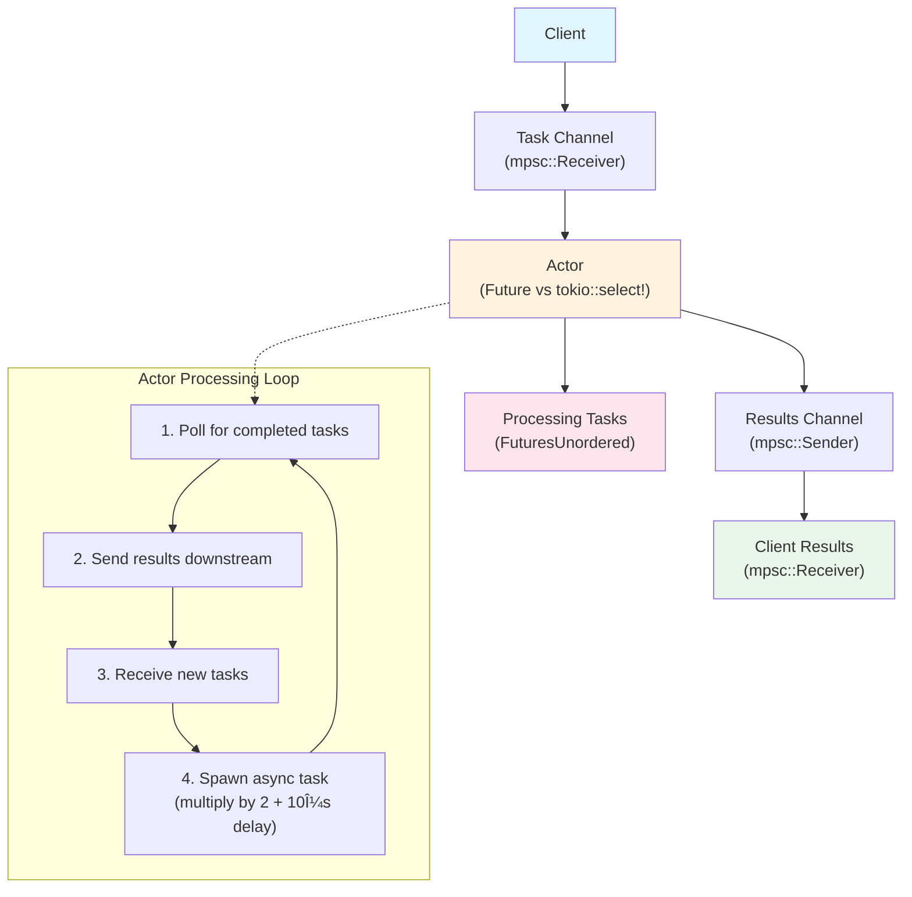

# 01: `Future` implementation vs. `tokio::select!` loop for actors

This benchmark compares the performance of a `Future` implementation vs. a `tokio::select!` loop for long-running actors.

```mermaid
graph TD
    A["Client"] --> B["Task Channel<br/>(mpsc::Receiver)"]
    B --> C["Actor<br/>(Future vs tokio::select!)"]
    C --> D["Processing Tasks<br/>(FuturesUnordered)"]
    C --> E["Results Channel<br/>(mpsc::Sender)"]
    E --> F["Client Results<br/>(mpsc::Receiver)"]
    
    subgraph "Actor Processing Loop"
        C1["1. Poll for completed tasks"] --> C2["2. Send results downstream"]
        C2 --> C3["3. Receive new tasks"]
        C3 --> C4["4. Spawn async task<br/>(multiply by 2 + 10μs delay)"]
        C4 --> C1
    end
    
    C -.-> C1
    
    style A fill:#e1f5fe
    style F fill:#e8f5e8
    style C fill:#fff3e0
    style D fill:#fce4ec
```